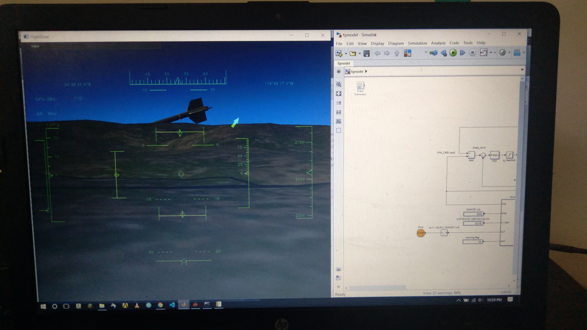

# 🚀 Missile GNC System

## 📌 Overview
A project focused on improving **Guidance, Navigation, and Control (GNC)** for accurate and stable missile targeting using simulation and embedded systems.

---

## 🎯 Problem
Improve missile accuracy and stability while avoiding obstacles and ensuring reliable trajectory control.

---

## 🧰 Materials
- Arduino  
- Servo Motor  
- Gyroscope Sensor  
- Battery  
- Rocket Model  
- Solid Rocket Motor  

---

## 🧠 Key Concepts
- GNC Systems  
- MATLAB & Simulink  
- Flight Simulation (FlightGear)  
- Control & Trajectory Design  

---

## 🛠️ Tools
- CATIA V5 (Modeling)  
- MATLAB Simulink (Control)  
- FlightGear (Simulation)  

---

## ⚙️ Workflow
1. Design model (CATIA)  
2. Develop control (MATLAB)  
3. Simulate (FlightGear)  
4. Analyze performance  

---

## 📅 Timeline
- Jan: Study  
- Feb: Calculations + Coding  
- Mar: Simulation  
- Apr: Fabrication  

---

## 📏 Reference Model
Based on AIM-9M missile:
- Speed: Mach 2.5–2.8  
- Range: ~35 km  
- Propulsion: Solid fuel  

---

## 💰 Budget
Approx. **6000 INR**

---

